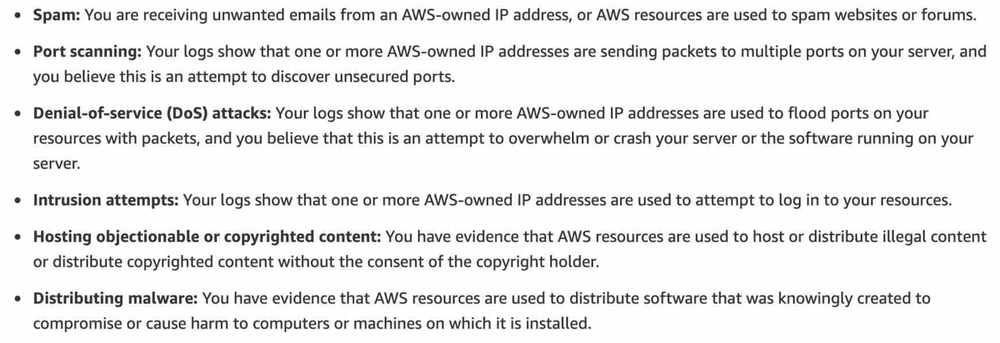

# Content

- [Shared Responsibility Model](#shared-responsibility-model)
- [6 Benefits of using AWS Cloud](#6-benefits-of-using-aws-cloud)
- [Cost Drivers](#cost-drivers)
- [AWS Partner Network (APN)](#aws-partner-network-apn)
- [Trusted Advisor](#trusted-advisor)
- [Support Plans](#support-plans)
- [Others](#others)

# Shared Responsibility Model

### AWS (Inherited Controls)

1. Physical and Environmental controls

### Customer

1. **Service and Communications Protection or Zone Security**: require a customer to route or zone data within specific security environments

### AWS and Customer (Shared Controls)

1. **Patch Management**: AWS patch infrastructure, customer patch guest OS and applications
2. **Configuration Management**: AWS configure infrastructure, customer configure own guest OS, databases and applications.
3. **Awareness and Training**: AWS trains AWS employees, customer train their own employees.

# 6 Benefits of using AWS Cloud

1. Trade fixed expense for variable expense
2. Benefit from massive economies of scale
3. Stop guessing capacity
4. Increase speed and agility
5. Stop spending money running and maintaining data centers
6. Go global in minutes

# Cost Drivers

- **CHARGE**:
  1. Compute
  2. Storage
  3. OUTBOUND data transfer
- **No Charge**:
  1. INBOUND data transfer
  2. Data transfer between other AWS services in the same region

# AWS Partner Network (APN)

- APN: global partner program for consulting and technology businesses that leverage AWS to build solutions for customers.

### APN Consulting Partner

- Help customers design, architect, build, migrate and manage workloads on AWS.
- Accelerates **migration** to AWS.

### APN Technology Partner

- Provides hardware, connectivity or software solutions.

# Trusted Advisor

- Online tool
- Provides **real-time guidance** to help you provision your resources
- Follows AWS best practices (_CSSFP_ - acronym to remember):
  1. Cost Optimization
  2. Security
  3. Services Limits (max allowed quota for a particular AWS service in your account)
  4. Fault Tolerance
  5. Performance Improvement

# Support Plans

- Plan prices go up in this order: **Basic (free), Developer, Business, Enterprise On-Ramp, Enterprise**

### Basic Support

- **Customer Service & Communities**: 24/7 access to customer service, documentation, whitepapers and support forums
- **AWS Trusted Advisor**: core trusted advisor checks and guidance to provision resources following best practices
- **AWS Health - Your Account Health Dashboard**: personalized view of the health of **your AWS services**, alerts when your resources are impacted.

### Support Plans Table

|                                                             |                 Basic                 |               Developer               |  Business   | Enterprise On-Ramp |   Enterprise   |
| ----------------------------------------------------------- | :-----------------------------------: | :-----------------------------------: | :---------: | :----------------: | :------------: |
| AWS Trusted Advisor Best Practice Checks                    | Service quota & basic security checks | Service quota & basic security checks | Full checks |    Full checks     |  Full checks   |
| Technical Support Cloud Support Associates (Business Hours) |                  ❌                   |                  ✅                   |     ✅      |         ✅         |       ✅       |
| Technical Support Cloud Support Engineers (24/7)            |                  ❌                   |                  ❌                   |     ✅      |         ✅         |       ✅       |
| Programmatic Access (AWS Support API)                       |                  ❌                   |                  ❌                   |     ✅      |         ✅         |       ✅       |
| Infrastructure Event Management                             |                  ❌                   |                  ❌                   |     ✅      |         ✅         |       ✅       |
| Access to AWS Managed Services (**for an additional fee**)  |                  ❌                   |                  ❌                   |     ✅      |         ✅         |       ✅       |
| Concierge Support Team                                      |                  ❌                   |                  ❌                   |     ❌      |         ✅         |       ✅       |
| Technical Account Management                                |                  ❌                   |                  ❌                   |     ❌      |    Pool of TAM     | Designated TAM |
| Incident Detection and Response (**for an additional fee**) |                  ❌                   |                  ❌                   |     ❌      |         ✅         |       ✅       |

# Others

### AWS Abuse Team

- AWS Abuse Team can assist you when AWS resources are used to engage in these behavior:

