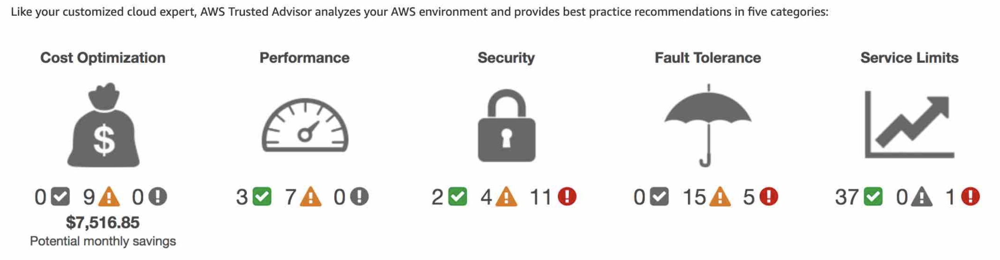
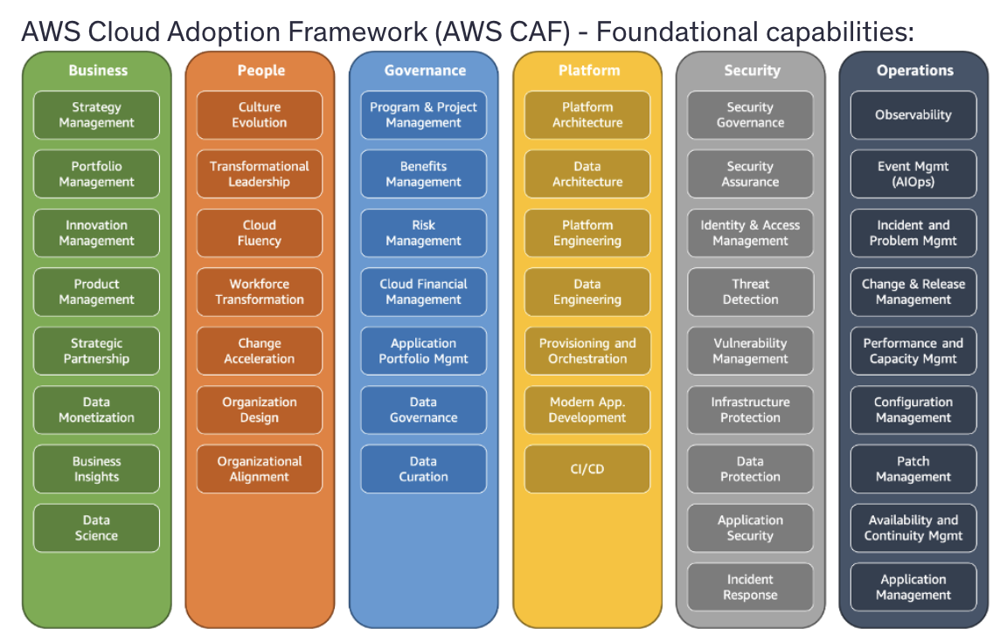
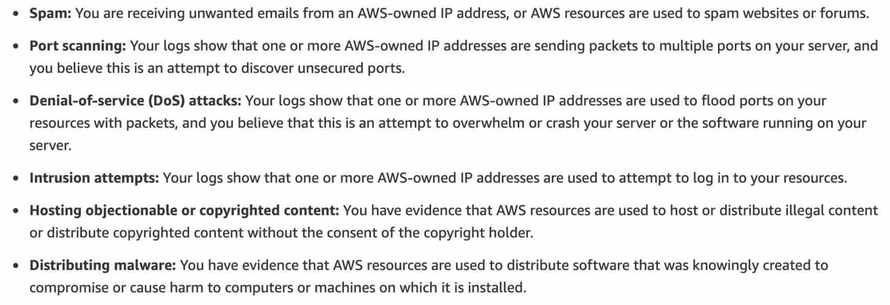

# Content

- [Shared Responsibility Model](#shared-responsibility-model)
- [6 Benefits of using AWS Cloud](#6-benefits-of-using-aws-cloud)
- [AWS Characteristics](#aws-characteristics)
- [Cost Drivers](#cost-drivers)
- [AWS Root Account](#aws-root-account)
- [AWS Professional Services](#aws-professional-services)
- [AWS Partner Network (APN)](#aws-partner-network-apn)
- [AWS Organizations](#aws-organizations)
- [Trusted Advisor](#trusted-advisor)
- [Support Plans](#support-plans)
- [Forums](#forums)
- [Cloud Adoption Framework (CAF)](#cloud-adoption-framework-caf)
- [AWS Well Architected Framework](#well-architected-framework)
- [Others](#others)

# Shared Responsibility Model

### AWS (Inherited Controls)

1. Physical and Environmental controls

### Customer

1. **Service and Communications Protection or Zone Security**: require a customer to route or zone data within specific security environments

- means customer is responsible for ensuring that their data is transmitted and stored in specific, predefined network or security zones that meet their security and compliance requirements.

### AWS and Customer (Shared Controls)

1. **Patch Management**: AWS patch infrastructure, customer patch guest OS and applications
2. **Configuration Management**: AWS configure infrastructure, customer configure own guest OS, databases and applications.
3. **Awareness and Training**: AWS trains AWS employees, customer train their own employees.

# 6 Benefits of using AWS Cloud

1. Trade fixed expense for variable expense
2. Benefit from massive economies of scale
3. Stop guessing capacity
4. Increase speed and agility
5. Stop spending money running and maintaining data centers
6. Go global in minutes

# AWS Characteristics

- **Agility**: develop, test and launch apps quickly
- **Elasticity**: acquire and release resources as you need
- **Reliability**: to recover from disruptions by acquiring resources
- **Scalability**: system grow/shrink to meet increase/decrease demand

# Cost Drivers

- **CHARGE**:
  1. Compute
  2. Storage
  3. OUTBOUND data transfer
- **No Charge**:
  1. INBOUND data transfer
  2. Data transfer between other AWS services in the same region

# AWS Root Account

- Enable MFA for root user because restricting root user account access is not possible
- Root user access credentials are the email address and password used to create the AWS account

# AWS Professional Services

- Global team of experts to help you realize your desired business outcomes when using AWS.
- They supplement your team with skills and experience
- Accelerates **migration** to AWS.

# AWS Partner Network (APN)

- APN: global partner program for **consulting** and **technology** businesses that leverage AWS to build solutions for customers.
- Third-party partners

### APN Consulting Partner

- Help customers design, architect, build, migrate and manage workloads on AWS.
- Accelerates **migration** to AWS.

### APN Technology Partner

- Provides hardware, connectivity or software solutions.

# AWS Organizations

- Centrally manage billing, control access, compliance and security
- Manage AWS accounts, **share reserved EC2 instances amongst all units**
- Automate account creation, create groups of accounts.
- **Service Control Policies (SCP)**: apply permission guardrails on IAM users and roles, overrides IAM policies.
- To remove AWS account from AWS organizations, the AWS account must be a **standalone account**. Means must accept AWS Customer Agreement, choose support plan, provide contact info and payment method.

### AWS Service Catalog

- Allows organizations to create and manage catalogs of IT services **approved for use** on AWS
- IT services: virtual machine images, servers, software and databases

# Trusted Advisor

- Online tool
- Provides **real-time guidance** to help you provision your resources
- Can identify under-utilized EC2 instances.
- Follows AWS **best practices** (_CSSFP_ - acronym to remember):
  1. Cost Optimization
  2. Security
  3. Services Limits (max allowed quota for a particular AWS service in your account)
  4. Fault Tolerance
  5. Performance
- All AWS customers get access to **7 core trusted advisor** checks to increase security and performance of AWS environment.
  1. S3 Bucket Permissions
  2. Security Groups - Specific Ports Unrestricted
  3. IAM Use
  4. MFA on Root Account
  5. EBS Public Snapshots
  6. RDS Public Snapshots
  7. Service Limits

# Support Plans

- AWS Support Center: hub for managing your support cases
- Plan prices go up in this order: **Basic (free), Developer, Business, Enterprise On-Ramp, Enterprise**

### Basic Support

- **Customer Service & Communities**: 24/7 access to customer service, documentation, whitepapers and support forums
- **AWS Trusted Advisor**: core trusted advisor checks and guidance to provision resources following best practices
- **AWS Health - Your Account Health Dashboard**: personalized view of the health of **your AWS services**, alerts when your resources are impacted.

### Support Plans Table

|                                                             |                 Basic                 |               Developer               |         Business         | Enterprise On-Ramp |   Enterprise   |
| ----------------------------------------------------------- | :-----------------------------------: | :-----------------------------------: | :----------------------: | :----------------: | :------------: |
| AWS Trusted Advisor Best Practice Checks                    | Service quota & basic security checks | Service quota & basic security checks |       Full checks        |    Full checks     |  Full checks   |
| Technical Support Cloud Support Associates (Business Hours) |                  ❌                   |                  ✅                   |            ✅            |         ✅         |       ✅       |
| Technical Support Cloud Support Engineers (24/7)            |                  ❌                   |                  ❌                   |            ✅            |         ✅         |       ✅       |
| Programmatic Access (AWS Support API)                       |                  ❌                   |                  ❌                   |            ✅            |         ✅         |       ✅       |
| Infrastructure Event Management                             |                  ❌                   |                  ❌                   | ✅ (with additional fee) |         ✅         |       ✅       |
| Access to AWS Managed Services (**for an additional fee**)  |                  ❌                   |                  ❌                   |            ✅            |         ✅         |       ✅       |
| Concierge Support Team                                      |                  ❌                   |                  ❌                   |            ❌            |         ✅         |       ✅       |
| Technical Account Management                                |                  ❌                   |                  ❌                   |            ❌            |    Pool of TAM     | Designated TAM |
| Incident Detection and Response (**for an additional fee**) |                  ❌                   |                  ❌                   |            ❌            |         ✅         |       ✅       |

### Use Cases

- Business, Enterprise
  - Provides Architectural, configuration and troubleshooting guidance
  - Production workload
  - 24/7 phone, email and chat access to tech support
- Developer
  - Provides generic architectural guidance
  - Test workloads
  - Business hours Email based tech support
- Provides Architectural, configuration and troubleshooting guidance
  - Business, Enterprise
- Testing environment, email based
  - Developer
- Production workloads
  - Business, Enterprise

# Forums

### AWS Knowledge Center

- Frequent and common questions, and AWS provided solutions
- Starting point to check for a solution or troubleshooting an issue with AWS services

# Cloud Adoption Framework (CAF)

- Leverages AWS experience and best practices to digitally transform and accelerate business outcomes.
- Identifies organizational capabilities that support successful cloud transformations. It helps a company figure out what they’re missing to successfully adopt the cloud.
- These capabilities provide best practice guidance that helps improve your cloud readiness.
- Common Stakeholder Role:
  - Engineer
  - Chief Technology Officer (CTO)
  - Architects

### 6 Foundational Capabilities

- **6 Perspectives** (_Acronym - BPPGSO_):
  1. Business
  2. People
  3. Platform
  4. Governance
  5. Security
  6. Operations

### 4 Cloud Transformation Phases

- **4 Cloud Transformation Phases** (acronym - EALS):
  1.  **Envision**: how cloud accelerates your business
  2.  **Align**: identify capability gaps across 6 CAF perspectives, cross-organizational dependencies and surfacing stakeholder concerns and challenges.
  3.  **Launch**: delivering pilot initiatives in production, demonstrating incremental business value
  4.  **Scale**: expanding production pilots and business value to desired scale. ensure business benefits with cloud investments are realized and sustained.

# Well-Architected Framework

- Provides guidance on building secure, high-performing, resilient and efficient infrastructure on AWS.
- Provides a consistent approach for customers and partners to evaluate architectures, and implement designs that will scale over time.
- Helps you understand the pros and cons of decisions you make while building systems on AWS.
- **6 Pillars**:
  1. Operational Excellence
  2. Security
  3. Sustainability
  4. Reliability
  5. Performance Efficiency
  6. Cost Optimization

### Operational Excellence

- Run and monitor systems to deliver business value
- Improve supporting processes and procedures
- Define infrastructure as code (IaC)

### Security

- Protecting information and systems
- Confidentiality and integrity of data
- Identifying and managing who can do what with privilege management
- Protecting systems and establishing controls to detect security events.

### Performance Efficiency

- Using IT and computing resources efficiently
- Selecting right resource types and sizes based on workload requirements, monitoring performance
- Making informed decisions to maintain efficiency as business needs evolve

### Cost Optimization

- Avoid un-needed costs
- Understanding and controlling where money is spent
- Select appropriate and right number of resource types, analyze spend over time.
- Scale to meet business needs without overspending

### Reliability

- Ensure a workload performs its intended function correctly and consistently
- Automatically recover from failure
- Scale horizontally, stop guessing capacity (use auto scaling)

### Sustainability

- Minimize environmental impact of cloud workloads
- Understand impact of resource usage (compute, storage)
- Choose region based on sustainability goals.

# Others

### AWS Abuse Team

- AWS Abuse Team can assist you when AWS resources are used to engage in these behavior:

### AWS Artifact

- Central resource for **compliance and security reports**
- **Reports**:
  - Service Organization Control (SOC)
  - Payment Card Industry (PCI)
  - Certifications from accreditation bodies that validate AWS security controls
- **Agreements**:
  - Business Associate Addendum (BAA)
  - Health Insurance Portability and Accountability Act (HIPAA)

### AWS Marketplace

- Digital catalog with software listings from independent software vendors
- Find, test, buy and deploy software that runs on AWS
- Software listing categories: security, networking, storage, machine learning, IoT, business intelligence, database and devOps
- If you have AWS account, can be both buyer (subscriber) and seller (provider)
- Common Products:
  - AMI (Amazon Machine Image)
  - SaaS
  - CloudFormation Template

### AWS Health - Your Account Health Dashboard (Personalized View)

- Provides alerts and remediation guidance when AWS is experiencing events that may impact you
- Alerts triggered by **changes in the health of YOUR AWS resources**

### AWS Health - Service Health Dashboard (Generic View)

- Learn about availability and operations of AWS services
- Can view overall / general status of AWS services
- Check https://health.aws.amazon.com/health/status to get current status of AWS services

### AWS Acceptable Use Policy

- Prohibited uses of web services offered by AWS
