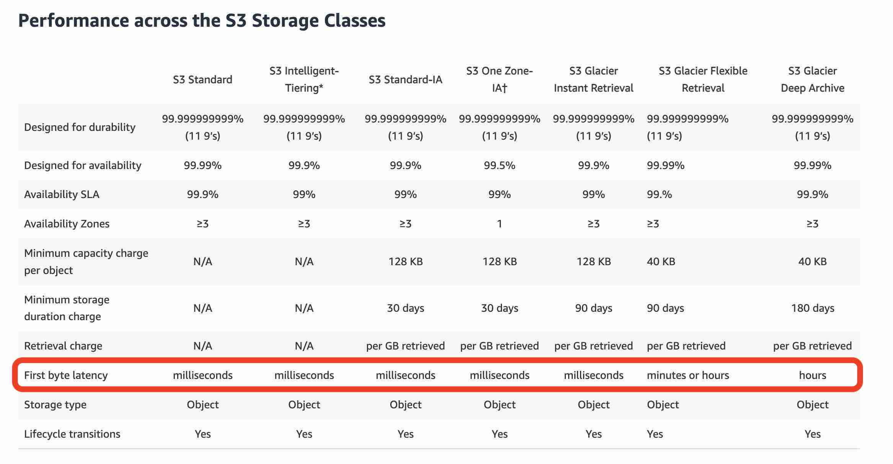
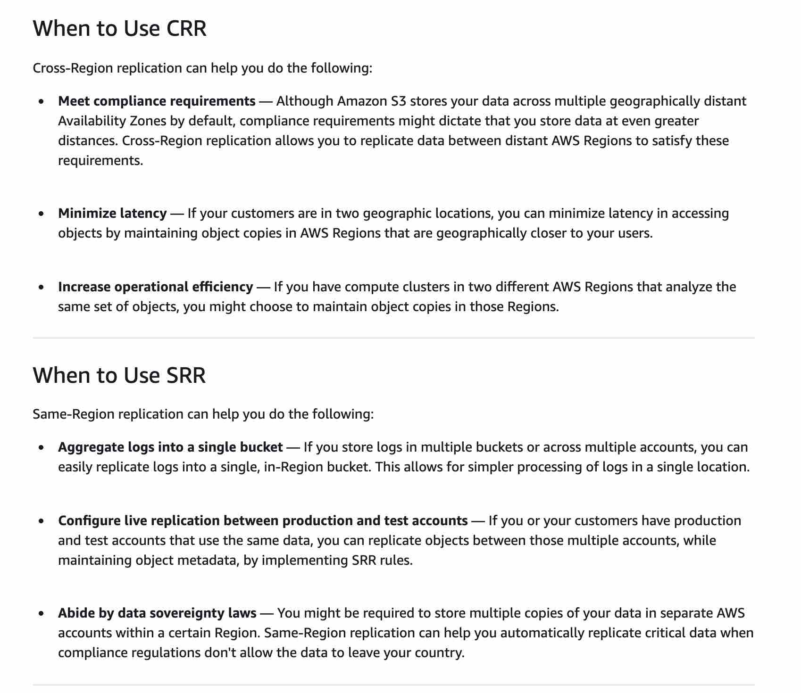
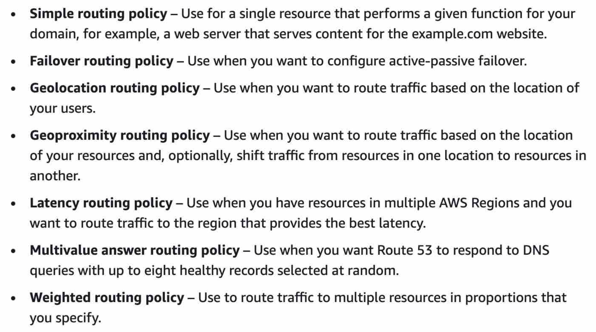
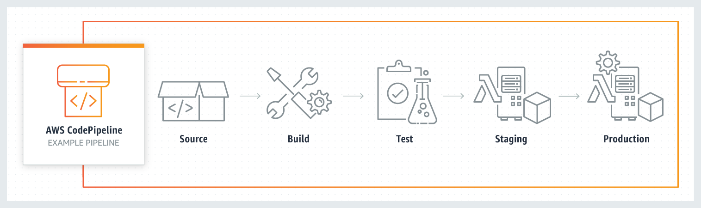

# Content

- [Serverless Services](#serverless-services)
- [Services that support reservations](#services-that-support-reservations)
- [Global Infrastructure](#global-infrastructure)
- [Databases](#databases)
- [Storage](#storage)
- [EC2](#ec2-elastic-compute-cloud)
- [Networking](#networking)
- [Deployment](#deployment)
- [Compute](#compute)
- [Monitoring](#monitoring)
- [VPC](#vpc)
- [CI/CD](#cicd)
- [Microservices](#microservices)
- [Security](#security)
- [Secrets Management](#secrets-management)
- [Machine Learning](#machine-learning)
- [AWS Systems Manager](#aws-systems-manager)
- [Tools to Access AWS Services](#tools-to-access-aws-services)
- [Others](#others)

# Serverless Services

- DynamoDB
- Lambda
- API Gateway
- SNS
- SQS
- Step Functions

# Services that support reservations

- EC2
- DynamoDB
- RDS
- ElasticCache Reserved Nodes
- Redshift Reserved Nodes

# Global

### Infrastructure

- **Region** (minimum 3 AZs)
- **AZ** (1 or more data centers)
- **Edge Location**
- **Local Zone**

### Global Services

- IAM
- CloudFront
- Route 53
- WAF
- AWS Global Accelerator
- S3 Transfer Acceleration

### Local Zone

- Local Zones allow you to use selected AWS services (compute and storage) closer to end users
- **Low latency access** to apps running **locally**
- Connected to **parent region** via **private network**
- Have connection to Internet and supports AWS Direct Connect
- AWS services available in Local Zones:
  - EC2
  - VPC
  - EBS
  - FSx
  - ELB
  - EMR
  - ElastiCache
  - RDS

### AWS Wavelength

- Extends AWS to global network of **5G edge locations**
- Enable building apps with ultra-low latency
- **Wavelength Zones**: high bandwidth, connection to parent AWS region

# Databases

### DynamoDB

- Serverless
- NoSQL (schemaless, key-value & document db)
- Supports **high availability** (stores data across multiple AZs)
- Continuous backups
- **DynamoDB Global Tables**: replicate data automatically across regions and scale capacity to handle workloads. offers active-active cross-region support
- **DynamoDB Accelerator (DAX)**: in-memory cache

### Aurora

- Fully managed RDS (MySQL and PostgreSQL)
- Higher throughput and faster performance than normal RDS.
- Supports multi-master (all instances can read/write).
- **Aurora Serverless**

### RDS (Relational Database Server)

- RDS instance types differ by CPU, memory, storage and networking capacity
- For OLTP (Online Transaction Processing)
- AWS manages hardware provisioning, database setup, patching and backups.
- Better performance than customer-managed database instance
- Customer (You) handle data encryption
- Supports MySQL, PostgreSQL
- **RDS Multi-AZ**: enhance availability, one primary db and synchronously replicates to standby instance (failover when primary db down).
- **RDS Read Replicas**: create read-only copies of master database. When failure, manually promote read replica to master db. horizontal scaling.

|                          Multi-AZ deployment                          |          Multi-Region deployment           |                 Read Replicas                  |
| :-------------------------------------------------------------------: | :----------------------------------------: | :--------------------------------------------: |
|                           High availability                           |  Disaster recovery and local performance   |                  Scalability                   |
| Non-Aurora: synchronous replication; Aurora: asynchronous replication |          Asynchronous Replication          |            Asynchronous Replication            |
|              Span at least 2 AZs within a single region               | Each region can have a Multi-AZ deployment | Can be within an AZ, Cross-AZ, or Cross-Region |

### ElastiCache

- In-memory cache
- Boost performance, high throughput and low latency

### AWS Neptune

- Managed **Graph** database

### AWS EMR (Elastic MapReduce)

- Big Data
- Process large amounts of data
- Uses Hadoop to run Hadoop Clusters

### AWS Redshift

- Managed **data warehouse**.
- For **large scale data set storage and analysis**
- Online analytical processing, run complex analytical queries (SQL or BI)
- Petabyte-scale

### AWS Glue

- Managed ETL (extract, transform, load) service
- Load data for analytics

# Storage

### AWS EFS (Elastic File System)

- **File** storage service, used with EC2
- Accessible from Linux instances via **NFS (Network File System)** protocol
- Support high availability by default (stores data across multiple AZs)
- Accessible storage for thousands of EC2 instances
- EFS file system can be mounted on instances across multiple AZs
- Petabytes
- EC2 instances can access AWS EFS **across AZs within the same region**
  - Cross-VPC access is possible with **VPC peering or Transit Gateway**
  - On-premises servers can access EFS using **AWS Direct Connect or VPN**, with proper routing and DNS configuration.
- **Infrequent Access Storage Class** (EFS-IA): pay a fee each time you read or write data on EBS

### AWS FSx for Windows File Server

- **File** storage service
- Accessible over Service Message Block (SMB) protocol
- High level throughput, IOPS and low latency
- Accessible from Windows, Linux and macOS compute instances
- Built on **Windows server**, delivers user quotas, end-user file restore and Microsoft Active Directory (AD) integration

### AWS FSx for Lustre

- **File** system, input and output stored on S3
- Only compatible with Linux
- For **compute-intensive**, fast processing workloads (**HPC**, ML, EDA, and media processing)

### AWS EBS (Elastic Block Store)

- **Block** storage service
- Accessed via **network**
- Only can attach to 1 EC2 instance, cannot multiple
- Persistent storage even when EC2 terminated
- EBS volume can be attached to 1 instance in the same AZ at a time
- EBS Snapshots are stored incrementally, means only billed for the changed blocks stored
- Use EBS Snapshots to move EBS volume across AZs or regions
- Priced by **volume type**, **size** and **provisioned IOPS**
  - e.g., gp3, io2, sc1

### Instance Store

- **Block** storage service
- Temporary storage, removed when EC2 terminated
- **Fast access** (good for cache), **physically attached to host computer**
- Good for data that is replicated across instances (load balanced pool of servers)

### S3 (Simple Storage Service)

- **Object** storage service
- **S3 Bucket Policy**: customer decides who gets access to data in S3 bucket
- **AWS Athena**: serverless. query and analyze S3 data using SQL.
- Buckets are **regional**
- Can deploy static website
  - Enable public access by editing block public access settings for that bucket
  - If website inaccessible, check bucket policy
- **S3 Versioning**:
  - prevent accidental deletion
  - restore every version of object stored in S3 bucket
  - versioning-enabled buckets enable you to recover objects from accidental deletion or overwrite
- **S3 Lifecycle Configuration**:
  - Tell S3 to transition objects to less expensive storage classes, archive or delete them
  - S3 does the transfer without human intervention
- **S3 Cross-Region Replication (S3 CRR)**
  - replicate data between distant AWS regions
  - asynchronous copying of objects between S3 buckets
- **S3 Same-Region Replication (S3 SRR)**
  - used to copy objects across Amazon S3 buckets in the same AWS Region

### AWS DocumentDB

- Managed document database (NoSQL)
- Supports **MongoDB**
- Store, query and index JSON data

### AWS Storage Gateway

- Connects on-premises to AWS.
- **3 types** of storage gateway (_acronym - FVT_)
  1. File Gateway: store files as objects in S3
  2. Volume Gateway: asynchronous backup to EBS as snapshots
  3. Tape Gateway: virtual tapes in S3 and Glacier
- Acts as a **bridge** between on-premises and AWS.

### AWS DMS (Database Migration Service)

- Help migrate database to AWS
- Source data remains fully operational during migration, minimize downtime.

### AWS ECR (Elastic Container Registry)

- Store Docker Images
- Pull image from ECR and run on ECS

# EC2 (Elastic Compute Cloud)

- IaaS
- Resizable compute capacity
- You manage underlying OS, virtual network configurations, storage, data.
- Requires **AMI (Amazon Machine Image)** to launch an instance
- **Methods to SSH to EC2**:
  1. **AWS Systems Manager Session Manager**: most secure. browser-based CLI. no need open inbound port 22, manage SSH keys or bastion host
  2. **Instance Connect**: need to open port 22 and manage SSH keys. web-based ssh via AWS Console
  3. **Traditional SSH**: manage SSH SSH key pair (`.pem`), open port 22. EC2 need public IP
  4. **SSH via Bastion Host (Jump Box)**: use publicly accessible EC2 bastion host as a gateway to private EC2 instances. connect to bastion then hop to private instances.

### Instance Types

1. **On-Demand**: no long-term commitment, no upfront payment, instance cannot be interrupted
2. **Reserved Instance (RI)**: save up to 75%, billing discount, 1 or 3 year commitment
3. **Savings Plan**: committed to specific amount ($/hour) to save on AWS usage , 1 or 3 year commitment
4. **Dedicated Host**: full physical server (most expensive), supports BYOL (Bring Your Own License)
5. **Dedicated Instance**: physically isolated at hardware level
6. **Spot Instance**: save up to 90%, bid for unused EC2 instances. For workloads that can be terminated at short notice, not critical (batch, data analysis).

### Billing

- Charged per second, minimum charge is 60 seconds.

# Networking

### ELB (Elastic Load Balancing)

- Distribute incoming traffic across EC2 instances, containers, IP addresses and Lambda functions
- Handle varying traffic load on single AZ or multiple AZs
- Supports Horizontal Scaling

### Auto Scaling

- Scaling service to spin up or down resources based on demand.
- Used with ELB
- Build scaling plans for resources:
  - EC2 and Spot Fleets
  - ECS tasks
  - DynamoDB tables and indexes
  - Aurora Replicas
- Free to use but pay for AWS resources created and CloudWatch (sends alarms) monitoring fees
- Use scaling policies to increase or decrease the number of instances in your group
- When scaling policy in effect, ASG adjusts desired capacity of the group (between min and max capacity)
  - Can also scale on a schedule (e.g., Fridays more traffic, scale out)

### Route 53

- Domain Name System (DNS)
- Translate domain names to IP address
- Other purposes: load balancing and testing new versions of software
- Route 53 Routing Policies

### AWS API Gateway

- Serverless
- Create, maintain and monitor APIs

### AWS CloudFront

- Serve static content (HTML, images, videos) in edge locations
- Protect against DDoS
  - AWS hosts CloudFront and Route 53 on a distributed network of proxy servers in data centers throughout edge locations
  - Using AWS global network of edge locations, DNS plays a crucial role in defending against DDoS
- Can deliver dynamic content (API acceleration and dynamic site delivery)

### AWS Global Accelerator

- Better global app availability and performance (improve by up to 60%)
- Uses **AWS Global Network** to optimize path from end user to your app
- Provides static IP addresses (Anycast IP), acts as fixed entry point to app endpoints in 1 or more AWS Regions
  - Endpoints: ALB, NLB, EC2
- Good for non-HTTP use cases: gaming (UDP), IoT (MQTT), or Voice over IP
- Good for HTTP use cases that require static IP addresses or deterministic fast regional failover.

### AWS MQ

- Managed message broker service for:
  - Apache ActiveMQ
  - RabbitMQ
- AWS MQ connect to your apps with standard APIs and protocols, so you can easily migrate to AWS without having to rewrite code.

### AWS Kinesis Data Streams

- **Real-time big data streaming**
- Add various types of data (app logs, social media) to Kinesis data streams from thousands of sources.
- Data is then read and processed from the stream

### AWS S3 Transfer Acceleration (S3TA)

- Fast and secure transfer of files between client and S3 bucket
- Goes through CloudFront's edge locations (optimized network path)

# Deployment

### Elastic Beanstalk

- PaaS
- For deploying and scaling web applications in multiple programming languages
- Beanstalk handles capacity provisioning, load balancing, auto scaling, health monitoring
- You have control and can access the underlying AWS resources
- Free service but you pay for underlying resources created.

### CloudFormation

- Infrastructure as Code (IaC)
- Use YAML or JSON to provision resources.

### Elastic Container Service (ECS)

- **ECS**:
  - launch and manage EC2 instances
  - manage Docker containers running on those instances.
  - manage underlying servers yourself
- **Fargate**:
  - serverless
  - no need to provision and manage servers

### AWS Lightsail

- Offers pre-configured, one-click-to-launch operating systems, development stacks and web apps (Linux, Window OS and WordPress)
- Cost-effective monthly plan

# Compute

### Lambda

- Serverless
- Run code without provisioning or managing servers
- Scales automatically
- **Pay for**
  - Compute time
  - Number of requests to Lambda function
- **Lambda Container Image**: deploy Lambda functions as container image (up to 10GB in size)
- Regional in scope

### Batch

- Batch computing workloads across AWS compute services
- Dynamically **provisions compute resources** (e.g., CPU or memory optimized instances)
- Provisions compute resources, runs the job, terminates resources when done

---

- `Exam`: "AWS Step Function vs Batch"
  - Batch provisions compute resources
  - Step function does not provision any resources, only orchestrate AWS services for a given workflow.

---

### AWS Snowball

- Data migration and edge computing device
- Offline data transfer, overcome challenge of limited bandwidth in remote location
- Moves TBs of data in about a week
- Use it to move things like databases, backups, archives, ...

# Monitoring

### AWS Budgets

- Set budgets. **Alerts** you when costs or usage exceed (or forecasted to exceed).
- Alerts you when reservation (RI or Savings Plan) utilization falls below threshold
- Alerts by SNS or email
- **AWS Budget Actions**: configure specific actions to respond to threshold exceed or falling below
- Refine budget to track costs by AWS service, linked account, tag
- Budgets information is updated up to 3 times a day, occurs 8 to 12 hours after the previous update
- **4 budget types**:
  1. Cost
  2. Usage
  3. Reservation
  4. Savings Plans

---

`Exam`: "CloudWatch Billing vs AWS Budgets"

- CloudWatch Billing: sends an alarm when the actual cost exceeds a certain threshold
- AWS Budgets: sends an alarm when the actual cost exceeds the budgeted amount or even when the forecasted cost exceeds the budget amount.

`Exam`: "AWS Cost Explorer vs AWS Budgets"

- AWS Budgets: can alert you when your costs exceed your budgeted amount.
- Cost Explorer: helps you visualize and manage your costs and usage over time.

---

### AWS Pricing Calculator

- Estimate cost of services in AWS

### AWS Cost and Usage Report (CUR)

- **Comprehensive** / **Detailed** set of AWS cost and usage data
- Can publish report to S3 bucket, breaks down costs by the hour
- Additional info on AWS services, pricing, credit, fees, taxes, discounts, cost categories, Reserved Instances and Savings Plans.
- Costs can by organized by Cost Allocation Tags and Cost Categories
- Available hourly, daily or monthly

### AWS Cost Explorer

- Visualize AWS costs and usage over time.
- Default report to view top 5 cost-accruing AWS services.
- Can view historical data and forecast costs for up to 12 months.
- **AWS Cost Explorer Resource**: **right-size** recommendations
  - Can identify under-utilized EC2 instances due to **right-sizing** feature
  - helps you save costs by downsizing / terminating EC2 instances
  - view all underutilized EC2 instances across member accounts in a single view

---

`Exam`: "AWS Cost & Usage Report (AWS CUR)" vs "AWS Cost Explorer"

- AWS CUR:
  - cost management tool, provides detailed cost and usage data for your AWS account
  - provide reports that break down your costs by the hour into your S3 bucket
  - csv file
- AWS Cost Explorer
  - high-level cost management tool
  - visualize the costs and usage associated with your AWS account

---

### AWS CloudTrail

- Enables governance, compliance, auditing of AWS account
- Provides event history of AWS account activity for actions taken through
  - AWS Management Console
  - AWS SDK
  - CLI
  - Other AWS services

### AWS CloudWatch

- Monitor apps, respond to system-wide health
- Performance monitoring, events and alerts
- Centralize server logs (EC2)
- **CloudWatch Alarm**: sends email to SNS (e.g., when alarm state changes from OK to ALARM). E.g., when CPU usage of EC2 exceeds a specified threshold

### AWS Config

- Resource and configuration change
- Audit and compliance
- Features of AWS Config:
  1. Evaluate AWS resource configurations for desired settings
  2. Get snapshot of current configurations of supported resources in AWS account
  3. Retrieve configurations of resources that exist in your account
  4. Retrieve historical configurations of one or more resources
  5. Receive notification when resource is created, modified or deleted
  6. View relationships between resources. E.g., find all resources that use a particular security group

### Cost Allocation Tags in AWS Billing

- Must activate both AWS generated tags and user defined tags separately before they can appear in Cost Explorer or on a cost allocation report
- For each resource, each tag key must be unique, and each tag key can only have 1 value

# VPC

- VPC: logically isolated section, launch AWS services in virtual network
- Control over your virtual networking environment including:
  - Selection of IP address range
  - Creation of subnets
  - Configuration of Route Tables and Network Gateways
- **VPC** spans across all AZs in the region
- **VPC Subnet** spans only 1 AZ in the region

### Direct Connect

- Network connection from on-premises to AWS
- **Private** connection (around 1 month to establish)
- To create a connection, you choose:
  - Hosted connection by AWS Direct Connect Delivery Partner
  - Dedicated connection from AWS (deploy at over 100 AWS Direct Connect locations)

### Site-to-Site VPN

- Network connect from on-premises to AWS
- Securely connect on-premises to VPC
- Low bandwidth requirement
- **Public** connection, goes over internet
- Components:
  - **AWS**: Virtual Private Gateway (VGW)
  - **Customer**: Customer Gateway

### AWS VPN (Virtual Private Network)

- Connection between on-premises to AWS global network
- Establish private encrypted tunnel
- Managed, elastic cloud VPN solution
- Consists of **2 services**:
  1. Site-to-Site VPN
  2. Client VPN

### VPC Endpoint

- Connect VPC to AWS services (only S3 and DynamoDB, other services need VPC interface endpoint)
- Powered by AWS PrivateLink.
- **Private** network, don't need public IP
- **2 types of VPC Endpoints**
  1. Interface Endpoint: elastic network interface with private IP
  2. Gateway Endpoint: specify as a target for a route in your route table for traffic destined to a supported AWS service

### Transit Gateway

- Connects multiple VPCs and on-premises networks through a **centralized hub**.
- **Private** connection

### Internet Gateway

- Allows communication between VPC and internet.
- For internet connectivity
- 2 Purposes:
  1. Provide a target in VPC route tables for internet-routable traffic
  2. Perform NAT for instances.

### NAT Gateway

- Enable instances in **private subnet** to **connect to internet or other AWS services**
- Used in Public Subnet to initiate outbound traffic to Internet
- Prevents internet from connecting to instances in private subnet
- Associate Elastic IP to NAT Gateway
- NAT Gateway managed by AWS, NAT Instance managed by you.

### Network ACL (Access Control List)

- Firewall for VPC **subnet** to control inbound and outbound traffic
- Can **ALLOW or DENY** traffic.
- **Stateless**: responses that allowed inbound traffic are subject to rules for outbound traffic (vice versa)
- Contains a numbered list of rules and evaluates these rules in the increasing order while deciding whether to allow the traffic

### VPC Peering Connection

- Networking connection between 2 VPCs
- Can route traffic between them **privately**
- VPC peering connection is **not transitive**, e.g., A <-> B, B <-> C, A cannot connect to C, must establish A <-> C

# CI/CD

### AWS CodeDeploy

- Automates code deployment to any instance (EC2, on-premises)
- Easier to quickly release new features

### AWS CodeCommit

- AWS version control like Git
- Deprecated

### AWS CodePipeline

- Continuous delivery service that orchestrates CI/CD pipeline

# Microservices

### AWS SNS (Simple Notification Service)

- Managed **pub/sub service**
- **Decouples microservices**, distributed systems, serverless applications
- Publisher fan-out messages to multiple subscriber endpoints like SQS, Lambda
- Can also fan-out notifications to end users via SMS and email

### AWS EventBridge

- Serverless
- **Task Scheduler** that creates, executes and manages schedules across AWS services
- When schedule runs, EventBridge sends a payload to the target service (you decide, e.g., Lambda).
- Provides real-time access to changes in data in AWS services

### AWS SQS (Simple Queue Service)

- Managed queuing service
- **Decouples microservices**, distributed systems, serverless applications
- Send, store and receive messages between software components
- **2 types** of message queues:
  1. Standard Queue
  2. FIFO Queue

### AWS X-Ray

- Analyze and debug distributed systems and microservices
- Trace requests as they travel through your app

# Security

### IAM (Identity and Access Management)

- Manage access to AWS services securely
- Users have no access until permissions are explicitly granted
- Can create IAM:
  1. **User**: use access keys for programmatic access to AWS CLI, AWS API, AWS SDK
  2. **Group**: collection of IAM users, apply permission to group applies to all users in the group
  3. **Role**: assigned to AWS service
- Mandatory elements in IAM Policy
  - Effect: ALLOW or DENY
  - Action: actions that the policy allows or denies

### Security Group

- Virtual firewall for your instance to control inbound and outbound traffic.
- Can specify **ALLOW** rules only.
- **Stateful**: If you allow traffic in one direction, the return traffic is automatically allowed, regardless of the rules.

### Web Application Firewall (WAF)

- Layer 7
- Monitor HTTP and HTTPS requests forwarded to:
  - AWS API Gateway
  - CloudFront
  - ALB
- Configure **Web ACL** (Access Control List) to filter requests by request signatures
- **WAF Rate-based rule**: block IP address of bad actors
- Blocks by IP addresses, HTTP headers, HTTP body, URI strings, SQL injection and XSS
- Blocks common web exploits (by creating security rules to check attack patterns):
  - SQL Injection
  - Cross-Site Scripting

### AWS Inspector

- **Automated Security Assessment** tool for vulnerabilities and deviations from best practices.
- Evaluates these services:
  1. **EC2**: leverage SSM agent, analyze against unintended network accessibility and running OS against known vulnerabilities
  2. **Container Images push to ECR**: assess container images as they are pushed
  3. **Lambda**: identifies software vulnerabilities and package dependencies.
- Send assessment findings to AWS Security Hub and AWS EventBridge

### AWS Shield

- Managed **DDoS protection** service
- **AWS Shield Standard**:
  - Free, protects layer 3 and 4 (network and transport) attacks
  - Works best with CloudFront, Route 53 and Global Accelerator
- **AWS Shield Advanced**:
  - Paid, protects against more sophisticated DDoS attacks. Layer 3, 4 and 7
  - Protects EC2, ELB, CloudFront, Route 53 and AWS Global Accelerator
  - Access to **AWS DDoS Response Team (DRT)**

### Encrypted services

- Has encryption by default:
  - AWS CloudTrail Logs
  - S3
  - Storage Gateway
- Optional:
  - EFS
  - EBS
  - RDS
  - Redshift

### AWS GuardDuty

- Threat detection service
- Monitors **malicious activity and unauthorized behavior** to protect your **AWS account (account level access)**
- Analyze events across accounts from:
  - CloudTrail (AWS user and API activity)
  - VPC Flow Logs (network traffic data)
  - DNS Logs (name query patterns)

### MFA

- **U2F Security Key**: device to plug into USB port of computer. enable U2F security key, tap device to activate mfa code
- **Virtual MFA Device**: 6-digit numeric code by TOTP, e.g., Google Authenticator
- **Hardware MFA Device**: hardware to generate 6-digit numeric code by TOTP

# Secrets Management

### AWS KMS

- Create and manage encryption keys
- Control their use across AWS services

### Keys

- **Customer Managed Key (CMK)**: KMS keys in your AWS account that you create, own and manage.
- **AWS Managed Key**: KMS keys created by AWS, used on your behalf by an AWS service
- **AWS Owned Key**: collection of KMS keys that an AWS service owns and manages in multiple AWS accounts. Keys are not in your AWS account but can be used to protect resources.

### AWS Secrets Manager

- Protect secrets needed to access your services and resources.
- Can rotate, manage and retrieve database credentials, API keys and other secrets throughout lifecycle.
- Eliminate hardcoding of sensitive info in plain text
- **Secrets Manager API**: retrieve secrets by calling

### AWS CloudHSM

- Cloud-based **hardware security module**
- Generate and use encryption keys on AWS
- Manage encryption keys using FIPS 140-2 Level 3 validated HSMs
- Managed service. Automates hardware provisioning, software patching, high availability and backups

# Machine Learning

- **AWS Transcribe**: speech to text
- **AWS Polly**: text to speech
- **AWS Translate**: language translation
- **AWS Macie**: protect sensitive data (personally identifiable information - PII)
- **AWS Rekognition**: identify objects, people, text, scenes and activities in images and videos, regional in scope
- **AWS Personalize**: Use ML for real-time personalized recommendations
- **AWS Comprehend**: NLP (Natural Language Processing) service to uncover information in unstructured data

# AWS Systems Manager

- Provides user interface to view **operational data** from multiple AWS services.
- Reduces the time to detect and resolve operational problems
- Group resources like EC2, S3 buckets, RDS instances
- Automates operational tasks
  1. Apply patches to EC2 or on-premises instances
  2. Run commands
  3. Configure servers across AWS or on-premises

# Tools to Access AWS Services

1. **AWS SDK**: programming language-specific APIs
2. **AWS Management Console**: console home page, user interface
3. **AWS Command Line Interface (CLI)**: using command line, automate through scripts. use access key ID and secret key

# Others

### AWS Step Functions

- Coordinate multiple AWS services into serverless workflows.
- Design and run workflows, stitch together services like Lambda, Glue and SageMaker.

### AWS Pinpoint

- Allows **marketers** and developers to deliver customer-centric engagement experiences.
- Captures customer usage data to draw real-time insights

### Compute Optimizer

- **Recommends optimal AWS resources** for your workloads by **analyzing your AWS resource usage**
- Helps to **reduce costs and improve performance**
- **Right-Size** workloads: Avoid over-provisioning or under-provisioning
- Delivers Recommendations for:
  - EC2 instances
  - EC2 Auto Scaling Groups
  - EBS Volumes
  - Lambda Functions
- Projects CPU, memory utilization and runtime of your workload would have been on recommended AWS resource options.
- Helps you understand how your workload would have performed on the recommended options before implementing the recommendations.

### AWS Lex and Connect

- **AWS Lex**: building conversational interfaces into app using voice and text. uses automatic speech recognition (ASR) for speech to text. uses natural language understanding (NLU) to understand text intent
- **AWS Connect**: contact center service to facilitate customer communication.

### AWS OpsWorks

- Configuration Management service
- Provides managed instances of **Chef** and **Puppet**
- Chef and Puppet are automated platforms that automate server configurations with code
- Automate configurations across EC2 instances or on-premises compute environments.

### AWS Kendra

- Managed intelligent **search service across multiple data sources** (HTML, PDFs, web pages, documents)
- Natural Language queries
